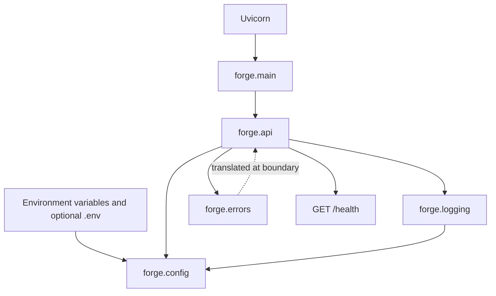

# Forge Architecture Overview

## Purpose

Forge is a reusable Python engineering foundation for future AI systems. It
provides packaging, typed configuration, structured logging, safe application
errors, a minimal HTTP boundary, tests, containers, CI, and operating
documentation without choosing a model provider or business domain.

Forge is a small modular monolith: one installable package, one runtime process,
and a few modules with explicit responsibilities. The design demonstrates
professional boundaries without introducing distributed-system complexity.

## Scope Boundary

Forge currently includes:

- A locked uv environment and `src/`-layout package
- Typed environment-driven settings
- Human-readable and JSON structured logging
- Context propagation and key-based sensitive-field redaction
- Framework-independent application errors
- A FastAPI application factory and `GET /health` endpoint
- Safe HTTP translation for expected and unexpected failures
- Unit, integration, container, and hosted CI validation
- A minimal non-root image and hardened local Compose service

Forge intentionally excludes model-provider integrations, databases,
persistence, authentication, authorization, deployment automation, metrics,
tracing, Kubernetes, package publishing, and example business logic. These are
future-project decisions, not incomplete Forge components.

## Component Structure

Arrows represent dependency direction. Lower-level modules do not import the
HTTP boundary. In particular, `forge.errors` contains no FastAPI status codes,
and `forge.config` knows nothing about application construction.

## Module Responsibilities

| Module | Responsibility | Depends on Forge modules |
| --- | --- | --- |
| `forge.__init__` | Declares the import-package boundary | None |
| `forge.config` | Defines validated settings, enums, dotenv loading, and secret masking | None |
| `forge.errors` | Defines stable public error codes and internal diagnostic storage | None |
| `forge.logging` | Configures Forge-owned structured logging, context, and redaction | `forge.config` |
| `forge.api` | Constructs FastAPI, wires settings and logging, defines health, and translates errors | `forge.config`, `forge.errors`, `forge.logging` |
| `forge.main` | Exposes the conventional ASGI object used by Uvicorn | `forge.api` |

The project remains deliberately concrete. There is no dependency-injection
framework, plugin system, service layer, repository abstraction, or global
settings singleton.

## Runtime Flows

### Application Startup

1. Uvicorn imports `forge.main:app`.
2. `forge.main` calls `create_app()`.
3. The factory loads a fresh `Settings` object unless one was supplied.
4. Process environment values override the optional local `.env` file.
5. Forge logging is configured for the validated level and renderer.
6. FastAPI is created with package-derived version metadata and debug disabled.
7. Settings are attached to `app.state`, exception handlers are registered,
   and the health route is added.

Tests and alternate runtimes can pass a `Settings` instance directly to
`create_app()`, avoiding hidden dependence on ambient process state.

### Health Request

1. A client sends `GET /health`.
2. FastAPI invokes the typed health handler.
3. The handler returns `HealthResponse(status="ok")`.
4. FastAPI serializes `{"status":"ok"}` with HTTP 200.

The route is a liveness check only. Forge has no external dependency whose
readiness could be reported.

### Error Translation

Expected failures use `ApplicationError` subclasses with a fixed public code
and message plus optional internal detail. At the HTTP boundary, FastAPI maps
known categories to explicit status codes and returns only the public fields.
Unexpected exceptions receive a generic `internal_server_error` response.
Exception text and traceback data are never copied into client responses.

## Cross-Cutting Boundaries

### Configuration and Secrets

Configuration enters through `FORGE_` environment variables and an optional,
ignored `.env` file. Pydantic validates runtime values, and the optional API key
uses `SecretStr` to mask ordinary representations. Secrets are neither committed
nor passed into the container by default.

### Logging

Forge configures only the `forge` logger namespace, replaces its own handlers
idempotently, and disables propagation. Context values use `contextvars`, which
supports concurrent async requests. Sensitive-looking mapping keys are redacted
recursively before either console or JSON rendering. Redaction is defense in
depth; callers must still avoid placing secrets in free-form messages.

### Packaging

Local synchronization installs Forge editably so source changes are reflected
without reinstalling. The container build installs the package non-editably and
copies only the finished virtual environment into the runtime image.

## Execution Environments

| Environment | Entry point | Configuration | Evidence |
| --- | --- | --- | --- |
| Local | `uv run uvicorn forge.main:app --reload` | Process environment and optional `.env` | Local quality commands and health request |
| Image | Dockerfile exec-form Uvicorn command | Runtime environment variables | Image health check and manual lifecycle commands |
| Compose | `docker compose up --build --detach --wait` | Safe defaults with explicit overrides | Compose health, logs, and hardened runtime inspection |
| Container smoke test | `scripts/container_smoke_test.sh` | Controlled test values | API, identity, image-content, filesystem, and security assertions |
| GitHub CI | `.github/workflows/ci.yml` | Pinned uv, Python, lockfile, and runner | Black, Ruff, MyPy, Pytest, and coverage checks |

All environments use `forge.main:app`; packaging and orchestration do not create
alternate application behavior.

## Validation Architecture

| Layer | Proves | Does not prove |
| --- | --- | --- |
| Unit tests | Module behavior, edge cases, redaction, validation, and factory contracts | Real HTTP transport or container behavior |
| Integration tests | FastAPI request/response behavior and exception translation | Image construction or host networking |
| Coverage gate | At least 90% statement and branch coverage across `forge` | Test quality by itself |
| Container smoke test | Image build, runtime identity, health, settings, contents, filesystem, and controls | Cloud deployment behavior |
| Hosted CI | Reproducible installation and local quality-gate parity on Ubuntu | Docker behavior or every supported operating system |

Black owns formatting, Ruff owns linting and imports, MyPy checks production
types, and Pytest owns behavioral and coverage verification. Their configuration
lives in `pyproject.toml` so local and CI commands share one policy.

## Security and Reliability Properties

- Local secret files and common generated artifacts are ignored.
- Logging redacts recognized sensitive keys before rendering.
- Client errors expose stable public messages rather than internal details.
- The runtime container uses fixed UID and GID 10001 and contains no uv, source
  tree, tests, Git metadata, or local dotenv file.
- Compose binds only to `127.0.0.1`, drops all capabilities, prevents privilege
  escalation, uses a read-only root filesystem, and limits writes to `/tmp`.
- CI grants only `contents: read`, disables persisted checkout credentials, and
  pins external actions to full commit SHAs.
- Timeouts, health checks, frozen installation, and explicit cleanup turn hangs
  and partial failures into visible failures.

These controls reduce risk but do not provide authentication, authorization,
rate limiting, hosted secret management, network policy, vulnerability scanning,
or production observability.

## Safe Extension Points

Future projects can extend Forge without changing its core boundaries:

- Add validated settings to `forge.config` and document their environment
  contract.
- Add `ApplicationError` subclasses for new expected failures, then explicitly
  decide how each transport translates them.
- Add business modules that depend on configuration, logging, and errors without
  importing FastAPI.
- Add API routes at the boundary and test them through the application factory.
- Introduce external clients behind narrow application-owned interfaces only
  when a real dependency exists.

New databases, model providers, authentication systems, queues, or deployment
targets require their own decisions. Forge does not preselect abstractions for
capabilities it does not yet have.

## Current Limitations

- `/health` proves liveness, not external dependency readiness.
- Only one minimal HTTP route exists.
- CI validates one Ubuntu and Python version rather than a compatibility matrix.
- Docker validation is local and is not part of hosted CI.
- `uv sync --frozen` treats `uv.lock` as the source of truth and does not verify
  that it reflects newer dependency edits in `pyproject.toml`; `uv lock --check`
  performs that freshness check.
- The macOS editable-install hidden-flag workaround is operational guidance, not
  a cross-platform guarantee.
- Clean-room reuse was measured on one macOS arm64 host; the result does not
  establish identical timing or behavior on every platform and network.

## Decision Record

The architectural reasoning behind Forge is maintained in
[`docs/DECISIONS.md`](../DECISIONS.md). Decisions are immutable historical
records except when correcting factual wording; a changed direction should
supersede an earlier record rather than silently rewriting its tradeoffs.
